<div align="center">

<!-- HEADER -->


<!-- PROFILE VIEWS -->


<!-- TYPING SVG -->
<br/>
<a href="https://git.io/typing-svg">
  
</a>

</div>

<!-- ABOUT ME -->

## About Me

```python
class Teej:
    def __init__(self):
        self.name        = "Tehrence Llenarez"
        self.university  = "National University - Manila"
        self.program     = "BS Computer Science (4th Year)"
        self.focus       = "Web Development"
        self.cat_person  = True

    def interests(self):
        return [
            "Full Stack Development",
            "UI/UX Design",
            "Responsive Web Apps",
            "Front-End Engineering"
        ]

    def philosophy(self):
        # much like cats...
        return {
            "curiosity":    "Exploring every corner of the stack",
            "independence": "Building full stack, end to end",
            "precision":    "Crafting clean, pixel-perfect interfaces",
            "persistence":  "Always landing on my feet",
        }
```

```  
   /\_/\  
  ( o.o )  ~ meow                    
   > ^ < 
```

---

<!-- TECH STACK -->

## Tech Stack

<div align="center">

| Languages | Frontend | Backend | Data & Tools |
|:---------:|:--------:|:-------:|:------------:|
|  |  |  |  |

</div>

---

<!-- GITHUB STATS -->

## GitHub Analytics

<div align="center">
        
</div>

<br/>

<div align="center">
  
</div>

<div align="center">
  <p>Random Dev Quote</p>
  
  
</div>

---

<!-- CONNECT -->

## Connect With Me :3

<div align="center">

[](https://www.linkedin.com/in/tehrence-llenarez)
[](https://www.instagram.com/tteej.l)
[](https://www.facebook.com/teej.llenarez)
[](mailto:llenareztjc@gmail.com)

</div>

---

<div align="center">
  
  
</div>

<!-- FOOTER -->

